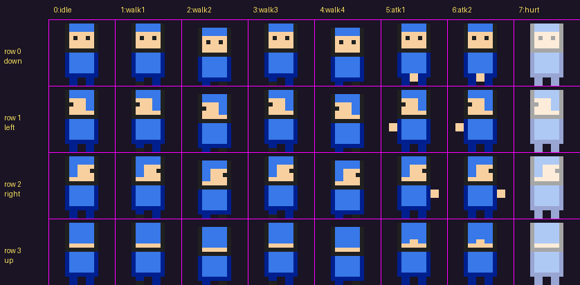

# Pocket Quest

A GBA-style, top-down action-adventure dungeon crawler for the browser, built with **Phaser 3** and **Vite**.
It runs at the GBA's native **240×160** resolution, scaled up with crisp pixels. You can play it on a phone with
on-screen retro controls, or on a desktop with a keyboard or gamepad. It installs as a **PWA** and works offline.

Nearly everything is **data-driven**:
- Weapons, spells, items, enemies, bosses, shops, spell teachers, dialogue and the world layout are JSON files.
- Maps are **Tiled** maps.
- Art is listed in a single asset manifest.

You can add content without touching game code.

---

## Contents

1. [Quick start](#quick-start)
2. [Controls](#controls)
3. [Testing on your phone](#testing-on-your-phone)
4. [Installing as an app (PWA) and offline play](#installing-as-an-app-pwa-and-offline-play)
5. [Project layout](#project-layout)
6. [Adding your sprites](#adding-your-sprites)
7. [Building maps in Tiled](#building-maps-in-tiled)
8. [Adding content (weapons, spells, enemies, bosses, shops, dialogue)](#adding-content)
9. [Adding a new town or dungeon](#adding-a-new-town-or-dungeon)
10. [Checking your data: `npm run validate`](#checking-your-data)
11. [Engine settings and control mapping](#engine-settings-and-control-mapping)
12. [What's in milestone 1](#whats-in-milestone-1)

---

## Quick start

You need [Node.js](https://nodejs.org) 18 or newer.

```bash
npm install
npm run dev        # dev server with hot reload, also reachable from your LAN
```

Open the `Local:` URL it prints (usually http://localhost:5173).

| Command | What it does |
|---|---|
| `npm run dev` | Development server (LAN-visible) |
| `npm run build` | Production build into `dist/` (includes the service worker for offline play) |
| `npm run preview` | Serve the production build (also LAN-visible, port 4173) |
| `npm run validate` | Check all data files and maps for typos and broken references |
| `npm run placeholders` | Re-create the placeholder tileset and icons if you deleted them |

> **Note:** After editing a JSON data file or a map, reload the page. Code changes hot-reload by themselves.

---

## Controls

All three input methods drive the same virtual buttons (see `src/config/input.config.js`).

| Button | Action | Keyboard | Gamepad (standard layout) |
|---|---|---|---|
| D-pad | Move (8 directions) / menu navigation | Arrows or WASD | D-pad or left stick |
| **A** | Attack / talk / open / confirm | J, Z or Space | A (bottom) |
| **B** | Cast equipped spell / back | K or X | X (left) or B (right) |
| **LB** | Cycle weapon / previous menu tab | Q or U | LB or LT |
| **RB** | Cycle spell / next menu tab | E or I | RB or RT |
| **Start** | Pause menu (items, weapons, spells, save) | Enter, Esc or P | Start / Menu |
| **Select** | Map (placeholder for now) | Tab, Right Shift or M | Back / View |

**A** talks or interacts when something is right in front of you; otherwise it attacks.

**Touch controls** appear automatically on phones and tablets:
- **Landscape:** D-pad on the left, A/B on the right, L/R in the top corners, Select/Start bottom center.
- **Portrait:** the screen sits on top with the controls below, like a Game Boy.
- **Multi-touch:** you can hold a direction and press A at the same time.
- **Sliding:** your thumb can slide across the D-pad, including diagonals, and slide from B onto A.
- **No accidental gestures:** pinch-zoom, scrolling, text selection and long-press menus are blocked. Notches and safe areas are respected.
- **Auto-hide:** the controls hide as soon as you use a keyboard or gamepad, and come back on the next touch.
- **Vibration:** light vibration on press (Android only; toggle it in Pause → System).

---

## Testing on your phone

1. Connect your computer and phone to the **same Wi-Fi network**.
2. Run `npm run dev`. Vite prints something like:
   ```
   ➜  Local:   http://localhost:5173/
   ➜  Network: http://192.168.1.23:5173/
   ```
3. On your phone, open the **Network** URL in Chrome (Android) or Safari (iOS).
4. Tap the **⛶** button between Select and Start for fullscreen (Android). On iOS, use *Add to Home Screen* (below).

**If the phone can't connect:**
- Allow Node through your computer's firewall. On Windows, allow it on **Private networks** when prompted.
- Some guest or office networks block devices from talking to each other ("client isolation"). Try a home network or your phone's hotspot.
- Make sure you're using the `Network` address, not `localhost`.

---

## Installing as an app (PWA) and offline play

The game ships a web-app manifest (fullscreen, with icons) and a service worker that precaches **everything**: code, art, maps and data. Once it's installed, it runs with no connection.

- **Desktop:** `npm run build && npm run preview`, open http://localhost:4173, then use the install icon in the address bar.
- **Phone:** browsers only enable service workers (offline mode and a true "install") on **HTTPS** or `localhost`. A plain `http://192.168.x.x` LAN address is fine for *playing and testing*, but not for installing. To install on your phone, use either of these:
  - **Deploy** the `dist/` folder to any static host with HTTPS, such as GitHub Pages, Netlify, Cloudflare Pages or itch.io. It uses relative paths, so it works from a sub-folder.
  - **Tunnel** your local preview over HTTPS, e.g. `npx cloudflared tunnel --url http://localhost:4173`.

  Then **Android Chrome:** ⋮ → *Install app*. **iOS Safari:** Share → *Add to Home Screen*.

The service worker only exists in production builds (`build`/`preview`), so it never caches stale files while you're developing.

---

## Project layout

```
├── index.html                 Page shell + on-screen controls markup
├── vite.config.js             LAN dev server, PWA manifest + offline caching
├── pocketquest.tiled-project  Open this in Tiled (object types with their properties)
├── public/                    Everything here is served as-is (edit without rebuilding)
│   ├── assets.json            THE asset manifest (sprites, images, fonts, audio)
│   ├── assets/                Your art: sprites/, tilesets/, backgrounds/, audio/ ...
│   ├── maps/                  Tiled maps (.tmj)
│   ├── data/                  Game content (JSON)
│   │   ├── world.json         Map list, starting position, new-game stats
│   │   ├── weapons.json  spells.json  items.json
│   │   ├── enemies.json  bosses.json
│   │   ├── shops.json  teachers.json  dialogue.json
│   └── icons/                 PWA icons
├── src/
│   ├── main.js                Boots Phaser, input, touch controls, scaling
│   ├── config/
│   │   ├── game.config.js     Resolution, scaling, player speed, i-frames, text speed, save slots
│   │   └── input.config.js    ALL control mapping (keyboard, gamepad, touch, actions)
│   ├── input/                 InputManager (single input layer), TouchControls
│   ├── scenes/                Boot, Title, World (any map), HUD, UI (dialogue), Pause, Shop
│   ├── entities/              Actor, Player, Enemy, Boss, NPC/Chest/Gate/Pickup
│   ├── systems/               db (data loading), assets (manifest + placeholders), Combat, GameState (saves)
│   └── ui/                    Pixel font, panels, list menus
├── tools/                     validate-data, placeholder art generator, starter-map generator
└── docs/sprite-templates/     Placeholder sheets exported as PNG templates
```

---

## Adding your sprites

Every texture the game uses is listed in **`public/assets.json`**. Each entry has `"file": null` and a
`placeholder` description. To use your art:

1. Put the PNG somewhere under `public/assets/`, e.g. `public/assets/sprites/player.png`.
2. Set `"file": "assets/sprites/player.png"` on that entry (paths are relative to `public/`).
3. Reload. That's it: no code changes.

If a file is missing or fails to load, the game logs a warning and falls back to the placeholder, so it never crashes over art.

### Character sheets (player, NPCs, enemies)

**Frames are 16×16.** The sheet is a grid with **one row per facing direction** and **one column per frame**:



| | Columns |
|---|---|
| **Rows (top → bottom)** | **0 = down** (facing the camera), **1 = left**, **2 = right**, **3 = up** (back) |
| **Column 0** | `idle`: 1 frame |
| **Columns 1-4** | `walk`: 4 frames, 8 fps, loops |
| **Columns 5-6** | `attack`: 2 frames, 12 fps, plays once (also used when casting) |
| **Column 7** | `hurt`: 1 frame (shown during knockback) |

So a standard character sheet is **128×64 px** (8 columns × 4 rows of 16×16).
The file `docs/sprite-templates/player.png` is a ready-made template at the exact size: paint over it.

You can export any sprite's current sheet (placeholder or yours) from the running game. Open the browser console and run `__exportSprite('slime')`.

**Bosses** use the `boss` layout: the same columns and rows, but with **32×32** frames (a **256×128** sheet).

**Changing the layout:** the layouts live at the top of `assets.json` under `"layouts"`. You can change them, add your own, or override anything for a single sprite:

```jsonc
"bat": {
  "layout": "character",
  "file": "assets/sprites/bat.png",
  "frameWidth": 16, "frameHeight": 16,           // override the layout's frame size
  "directions": ["down", "right", "up"],          // no "left" row → right is mirrored automatically
  "animations": { "walk": { "column": 1, "frames": 2, "fps": 10 } },  // override one animation
  "body": { "width": 10, "height": 8 }            // collision box at the feet (optional)
}
```

- `directions` lists the rows in order. Leave out `"left"` to save drawing: the game flips the `right` row.
- Each animation is `{ "column": firstColumn, "frames": count, "fps": speed, "repeat": -1 }`. Use `repeat: 0` to play once.
- `body` is the physics box, sitting bottom-centred in the frame (defaults: 62% of the width, 50% of the height). Add `offsetX`/`offsetY` to position it manually.

### Single images (projectiles, pickups, chests, icons)

The entries under `"images"` are single PNGs. Suggested sizes match the placeholders:

| Key | Size | Used for |
|---|---|---|
| `arrow`, `bone` | 6×2 / 6×6 | Bow arrow (drawn pointing **right**, it gets rotated), skeleton bone |
| `fireball`, `rock` | 8×8 | Fire Bolt spell, boss rocks |
| `coin`, `heart`, `mana` | 7×7 | Drops |
| `chest_closed`, `chest_open`, `sign`, `gate` | 16×16 | Props (`gate` is tiled to fill a gate's rectangle) |
| `shadow` | 12×4 | Soft shadow under characters (semi-transparent) |
| `icon_*` | 12×12 | Weapon / spell / item icons in the HUD |

Any new key you add here can be referenced from data files (e.g. a new weapon's `icon` or projectile `sprite`).

### Tilesets

Tilesets aren't in `assets.json`. They come straight from your Tiled maps (see below): any tileset image a map uses is loaded automatically.
Use **16×16 tiles**, no margin or spacing.

### Font (optional)

A crisp, hand-drawn pixel font is built in. To use your own, export a BMFont (`.fnt`/`.xml` plus `.png`, e.g. from
Hiero, BMFont or Littera) and add it to `assets.json`:

```json
"fonts": { "pixel": { "image": "assets/fonts/myfont.png", "data": "assets/fonts/myfont.xml" } }
```

### Audio (hook ready)

`"audio": { "key": { "file": "assets/audio/x.ogg" } }` entries are loaded. Sound effects and music playback are planned for the next milestone.

---

## Building maps in Tiled

Install [Tiled](https://www.mapeditor.org) (1.10 or newer) and open **`pocketquest.tiled-project`**
(*File → Open File or Project*). This registers the game's object types, so each one shows the right properties.

Starter maps are in `public/maps/` (Town 1, four dungeon rooms and a stub for Town 2). Open them and play around.

### Map rules

- **Orientation:** orthogonal. **Tile size:** 16×16. **Not infinite.**
- **Save format:** JSON (`.tmj`). Tilesets can be external (`.tsj`) or embedded; both work.
- **Tile layers:** order matters, top of the list is drawn last.

| Layer name | Purpose |
|---|---|
| `ground` | Floor. Drawn below everything. |
| `walls` | **Every tile on this layer is solid.** (Any layer whose name contains `wall`, `collision` or `block` works the same. Hide it if you want an invisible collision layer.) |
| `above` | Drawn **over** the player: tree canopies, roof edges, arch tops. (Or give any layer the bool property `above = true`.) |

You can also make individual tiles solid **on any layer**. In the tileset editor, select the tiles and add a bool property `collides = true`. The placeholder tileset already does this for water, trees, walls and so on.

### Objects

Add an **Object Layer** (any name, e.g. `objects`). Set each object's **Class** (called *Type* in older Tiled) to one of the types below.
Use **point** objects or 16×16 rectangles for things, and real rectangles for areas.

| Class | Shape | Properties | What it does |
|---|---|---|---|
| `spawn` | point | **Name** (e.g. `start`), `facing` | Where the player appears when arriving by warp. |
| `warp` | rectangle | `map` (id from world.json), `spawn` (spawn name in that map), `facing` | Walking into it moves the player to another map. |
| `npc` | point | `sprite`, `dialogue` (id in dialogue.json), `facing`, `wander` (bool) | A person you can talk to. |
| `shop` | point | `sprite`, `shop` (id in shops.json), `dialogue` (optional) | Shopkeeper; opens the buy menu. Talking works across a counter. |
| `teacher` | point | `sprite`, `teacher` (id in teachers.json) | Spell teacher; sells spells. |
| `healer` | point | `sprite`, `dialogue`, `price` (default 0) | Restores HP/MP, sets the respawn point and **saves**. |
| `sign` | point | `text` (use `\n` or a new line for line breaks) | Readable sign. |
| `chest` | point | Any of `weapon`, `spell`, `item` + `count`, `gold`, `maxHp`, `maxMp`, `flag` | Treasure chest; stays open forever once opened. |
| `enemy` | point | `enemy` (id in enemies.json) | Spawns an enemy each time the map loads. |
| `boss` | point | `boss` (id in bosses.json) | Spawns the boss until it has been defeated. |
| `gate` | rectangle | `flag` **or** `mode = boss`; `text` | Solid barrier. With `flag`, it opens once that story flag is set (e.g. by a boss reward). With `mode = boss`, it is open but shuts while the room's boss fight is on. `text` is shown when you press A on it while it's closed. |

### Connecting maps

1. Put a `spawn` named e.g. `south` just inside an entrance in map **B**.
2. In map **A**, draw a `warp` rectangle over the exit with `map = B`, `spawn = south`.
3. Do the same in reverse to come back. Keep spawn points **outside** warp rectangles so you don't bounce straight back.
4. Run `npm run validate`. It checks that every warp points to a real map and spawn.

`tools/gen-maps.mjs` is the script that generated the starter maps. You don't need it. It won't overwrite existing maps unless you pass `--force`, which would erase your Tiled edits.

---

## Adding content

All content lives in `public/data/`. Ids (the JSON keys) are what maps and other files refer to.
After editing, run `npm run validate`, then reload the game.

### Weapons — `weapons.json`

```json
"sword": {
  "name": "Sword", "description": "Quick, short swing.", "icon": "icon_sword",
  "shape": "arc",          // arc (wide swing) | thrust (narrow poke) | projectile
  "damage": 3,
  "cooldownMs": 280,       // time between attacks (speed)
  "range": 14,             // reach in px in front of the player
  "width": 20,             // hitbox width in px across the swing
  "activeMs": 110,         // how long the hitbox stays active
  "lockMs": 160,           // how long the player can't move after attacking
  "knockback": 150,
  "color": "#f8f8f8",      // swing effect colour
  "price": 30
}
```

For `"shape": "projectile"`, add `"projectile": { "sprite": "arrow", "speed": 210, "range": 170, "size": [6, 6], "pierce": false }`.
Any weapon can also have an `"effect": { "slow": 0.5, "durationMs": 2000 }`.

Ways the player gets weapons:
- `world.json` → `newGame.weapons`
- A chest with `weapon`
- A shop stock entry `{ "weapon": "id", "price": 60 }`
- A boss `reward.weapon`

### Spells — `spells.json`

| `type` | Extra fields |
|---|---|
| `projectile` | `damage`, `knockback`, `projectile: { sprite, speed, range, size, pierce }`, optional `effect` |
| `area` | `damage`, `radius`, `knockback`, `color`, optional `effect` (e.g. `{ "slow": 0.4, "durationMs": 3500 }`) |
| `heal` | `amount` |

Every spell has `name`, `description`, `icon`, `mpCost` and `cooldownMs`.

Ways the player gets spells:
- `newGame.spells`
- A spell teacher (`teachers.json`)
- A chest with `spell` (works as a scroll)
- A boss `reward.spell`

### Items — `items.json`

```json
"potion": { "name": "Potion", "description": "Restores 10 HP.", "icon": "icon_potion", "use": { "hp": 10 }, "price": 10 }
```

`use` can restore `hp` and/or `mp`. Items are used from Pause → Items.

### Enemies — `enemies.json`

```json
"archer": {
  "name": "Skeleton Archer", "sprite": "skeleton", "hp": 8, "contactDamage": 2, "speed": 22,
  "ai": {
    "idle": "wander",              // wander | flutter (erratic) | stand
    "sightRange": 100,             // notices the player within this many px
    "loseRange": 150,              // gives up beyond this
    "onSight": "keepDistance",     // chase | keepDistance | charge | none
    "chaseSpeed": 30,
    "preferredDistance": 56,       // for keepDistance
    "charge": { "windupMs": 450, "speed": 140, "durationMs": 380, "restMs": 650 },  // for charge
    "attack": {                    // optional ranged attack, works with any onSight
      "type": "projectile", "cooldownMs": 1700, "windupMs": 350,
      "projectile": { "sprite": "bone", "speed": 95, "range": 160, "damage": 2, "size": [6, 6] }
    }
  },
  "drops": [ { "type": "gold", "amount": [2, 5], "chance": 0.8 }, { "type": "heart", "chance": 0.2 } ]
}
```

Drop types are `gold` (amount is a number or `[min, max]`), `heart` (+4 HP) and `mana` (+3 MP).
Enemies flash before they attack, which tells the player it's coming.

### Bosses — `bosses.json`

A boss has `name`, `sprite`, `hp`, `contactDamage`, `speed`, `restMs` (pause between attacks), **phases**, **patterns** and a **reward**.

```json
"phases": [
  { "hpBelow": 1.0, "patterns": ["walk", "volley", "walk", "slam"] },
  { "hpBelow": 0.5, "message": "The Warden's core glows red!", "tint": "#f87050", "speedMul": 1.4,
    "patterns": ["charge", "volley_fast", "summon", "charge", "slam", "aimed"] }
]
```

The boss loops through the current phase's pattern list. When its HP drops to a phase's `hpBelow` fraction, it switches to that phase: it shows the message, takes on the tint, gets faster, and briefly becomes invulnerable while the screen shakes. You can add as many phases as you like.

Pattern types:

| `type` | Fields |
|---|---|
| `chase` | `durationMs` |
| `charge` | `windupMs`, `speed`, `durationMs` (stops early if it hits a wall) |
| `area` | `windupMs` (shows a warning circle), `radius`, `damage`, `knockback`, `color` |
| `radial` | `windupMs`, `count`, `waves`, `waveDelayMs`, `projectile` (a ring of shots; alternate waves are offset so there are gaps to dodge through) |
| `aimed` | `windupMs`, `count`, `spreadDeg`, `waves`, `waveDelayMs`, `projectile` (a fan aimed at the player) |
| `summon` | `windupMs`, `enemy`, `count`, `max` (minions alive at once) |

`reward` accepts `weapon`, `spell`, `item` + `count`, `gold`, `maxHp`, `maxMp`, `flag` and `message`.
Defeating a boss also sets the flag `boss:<id>`, so it never respawns. The reward `flag` is what opens `gate`s, and that's how a boss unlocks the path to the next city.

### Shops and spell teachers — `shops.json`, `teachers.json`

```json
"town1_shop":    { "name": "Market Stall", "greeting": "Welcome!", "stock": [ { "weapon": "spear", "price": 60 }, { "item": "potion", "price": 10 } ] }
"town1_teacher": { "name": "Spell Teacher", "greeting": "...", "spells": [ { "spell": "ice", "price": 25 } ] }
```

Stock entries can be `weapon`, `item` or `spell`. Owned weapons and learned spells show as *Owned* / *Learned*.

### Dialogue — `dialogue.json`

```json
"elder": {
  "speaker": "Elder",
  "pages": ["First box of text.", "Second box. Long pages are split into several boxes automatically."],
  "setFlag": "talked_to_elder",
  "variants": [
    { "if": { "flag": "dungeon1_cleared" }, "pages": ["Thank you for saving us!"] }
  ]
}
```

The first variant whose `if` matches is used. Conditions (all must match): `flag`, `notFlag`, `hasWeapon`, `hasSpell`, `hasItem`, `minGold`.

---

## Adding a new town or dungeon

The world is a chain: **town → dungeon rooms → boss → gate opens → next town**. To add the next link:

1. **Build the maps in Tiled** (save them to `public/maps/`), e.g. `town2.tmj`, `dungeon2_1.tmj`… `dungeon2_boss.tmj`.
2. **Register them** in `public/data/world.json` → `maps`:
   ```json
   "dungeon2_1": { "file": "maps/dungeon2_1.tmj", "name": "Dungeon 2", "kind": "dungeon" }
   ```
   `name` is shown in a banner when you enter an area with a different name.
3. **Connect them** with `warp` + `spawn` objects (see [Connecting maps](#connecting-maps)).
4. **Add the boss** to `bosses.json`, with a reward `flag` such as `"dungeon2_cleared"`, and place a `boss` object in the boss room.
5. **Lock the way forward** with a `gate` whose `flag` is `dungeon2_cleared`. Optionally add a `gate` with `mode: boss` at the boss-room entrance.
6. **Add NPCs, a shop, a teacher and a healer** to the new town, with new entries in `dialogue.json`, `shops.json` and `teachers.json`.
7. Run `npm run validate`.

Town 2 is already stubbed (`public/maps/town2.tmj`). Building it out is the natural next step.

---

## Checking your data

```bash
npm run validate
```

This checks every JSON file, `assets.json` and every map for:
- invalid JSON
- unknown ids (weapons, enemies, dialogue…)
- missing files
- warps pointing to maps or spawns that don't exist
- unknown boss patterns
- infinite maps

If something fails to load in the game itself, the error is shown on screen as well.

---

## Engine settings and control mapping

- **`src/config/input.config.js`:** keyboard codes, gamepad button indexes, touch options (vibration, D-pad dead zone, diagonal angle) and the **action → button** mapping (`attack: 'A'`, `cast: 'B'`, …). Change controls here, and only here.
- **`src/config/game.config.js`:**
  - resolution and integer scaling (`integerScaling: false` fills the screen instead)
  - player speed, invincibility time, knockback, MP regeneration, interaction reach
  - text speed and save slots
  - `debugPhysics: true` shows the hitboxes

**Saves** go to `localStorage` on the device. There are 3 slots, picked on the title screen. You can save at a healer, or anywhere from Pause → System → Save. Save data has a version number, so the format can be migrated later (`migrate()` in `src/systems/GameState.js`).

**Debugging in the browser console:**
- `__game` is the Phaser game instance.
- `__game.scene.getScene('World').goTo('dungeon1_boss', 'south')` teleports you.
- `__exportSprite('player')` downloads a sheet template.

---

## What's in milestone 1

- Working touch controls in both orientations, plus keyboard and gamepad through one input layer
- **Town 1:** an elder, a kid with tips, a market stall (shop), a spell teacher, a healer/save point, signs and a chest
- **Dungeon 1:** 3 rooms plus a boss room:
  - slimes (chase you)
  - skeleton archers (keep their distance and shoot)
  - cave bats (wind up, then charge)
  - chests (the Bow, potions, gold)
- **Boss:** the Stone Warden, with a health bar and 6 attack patterns. Below 50% HP it switches to a faster, angrier phase 2. It drops the Axe and +4 max HP, and opens the gate to Town 2.
- **Weapons:** Sword (fast, short), Spear (long reach), Axe (slow, heavy, wide) and Bow (ranged)
- **Spells:** Fire Bolt (projectile), Frost Ring (slows enemies) and Heal
- Knockback and invincibility frames, damage numbers, drops, MP regeneration and death with respawn
- A pause menu to use items, swap weapons and spells, save, and toggle vibration
- 3 save slots on the device, a PWA you can install, and full offline play
